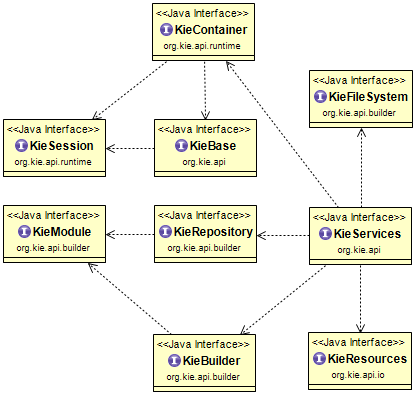

# Concepts

## Key components

Before using Drools 6.x, you must understand these key components.

### KieBase

The `KieBase` is a repository of all the application's knowledge definitions. It will contain rules, processes, functions, type models. The `KieBase` itself does not contain runtime data, instead sessions are created from the `KieBase` in which data can be inserted and process instances started.

### KieServices

The `KieServices` is a thread-safe singleton acting as a hub giving access to the other Services provided by Kie. As general rule a `getX()` method just returns a reference to another singleton while a `newX()` one creates a new instance.

### KieContainer

A container for all the `KieBase`s of a given `KieModule`.

### KieModule

A `KieModule` is a container of all the resources necessary to define a set of `KieBase`s like a `pom.xml` defining its `ReleaseId`, a `kmodule.xml` file declaring the `KieBase`s names and configurations together with all the `KieSession` that can be created from them and all the other files necessary to build the `KieBase`s themselves

### KieSession

`KieSession` is the most common way to interact with the engine. A `KieSession` allows the application to establish an iterative conversation with the engine, where the state of the session is kept across invocations. The reasoning process may be triggered multiple times for the same set of data. After the application finishes using the session, though, it must call the `dispose()` method in order to free the resources and used memory.

### KieResources

`KieResources` is a factory that provides Resource implementations for the desired IO resource.

### KieRepository

`KieRepository` is a singleton acting as a repository for all the available `KieModules` regardless if they are stored in the maven repository or programmatically built by the user.

### KieBuilder

`KieBuilder` is a builder for the resources contained in a `KieModule`.
